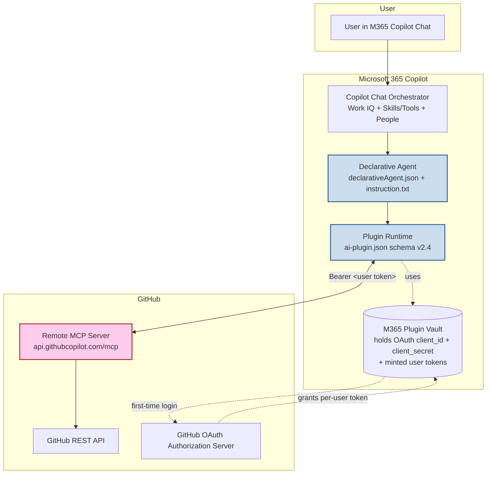
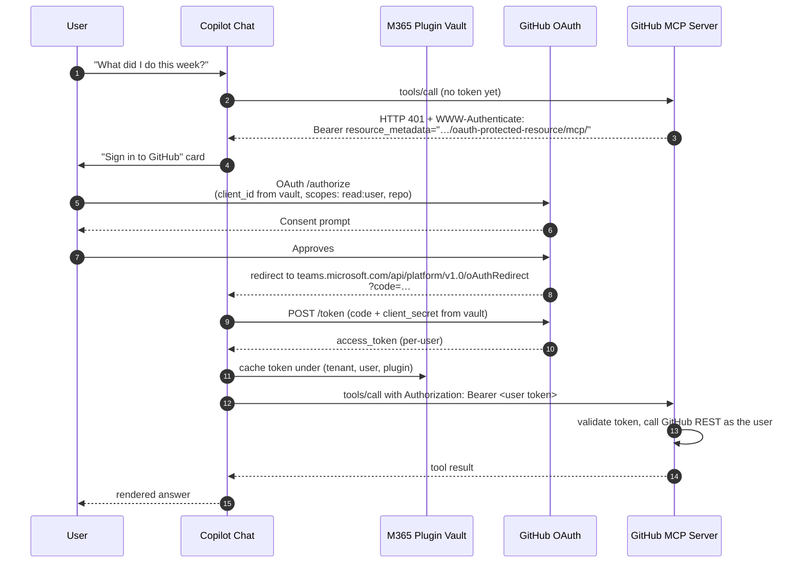
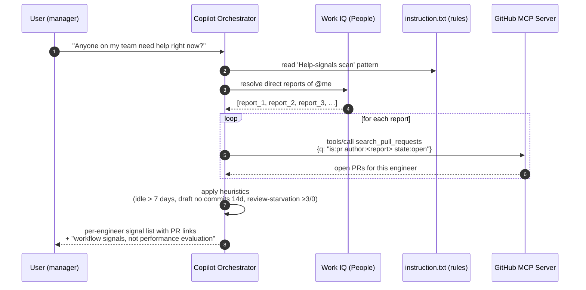

# Architecture

## Layered view

**What we own**: the two cyan boxes (the declarative agent + plugin
manifest). Everything else is Microsoft or GitHub infrastructure.

---

## OAuth handshake (per user, first call only)

Subsequent turns reuse the cached token until it expires; the runtime
silently refreshes (or re-prompts) as needed.

---

## Manager fan-out flow (single turn: "Anyone on my team need help?")

This is the core manager-seamless pattern: the agent never stores who
the team is, never caches PR state — it asks Work IQ at query time and
asks GitHub through the user's own token. The result is fresh by
construction.

---

## File-by-file responsibility

| File                                  | Owns                                                                                  |
| ------------------------------------- | ------------------------------------------------------------------------------------- |
| `appPackage/manifest.json`            | Teams app shell — id, icons, developer info, points at the declarative agent          |
| `appPackage/declarativeAgent.json`    | Conversation starters, agent name/description, `People` capability, points at plugin  |
| `appPackage/ai-plugin.json`           | Declares 14 MCP function names, the runtime endpoint, and OAuth-vault reference       |
| `appPackage/mcp-tools.json`           | The curated tool list (matches the MCP server's `tools/list` shape)                   |
| `appPackage/instruction.txt`          | The brain — persona routing, tool selection, output formatting, manager safety rules  |
| `m365agents.yml`                      | Provision/publish lifecycle steps (`teamsApp/*`, `oauth/register`)                    |

---

## Why MCP instead of OpenAPI

A predecessor repo (`enginsights-copilot`) used a custom OpenAPI plugin
pointing at a FastAPI service we hosted. That worked, but:

| Concern                  | OpenAPI plugin (predecessor)             | MCP plugin (this repo)                          |
| ------------------------ | ---------------------------------------- | ----------------------------------------------- |
| Hosting                  | Our Azure App Service ($)                | GitHub's `api.githubcopilot.com/mcp/` (free)    |
| Auth                     | GitHub App + tenant-config JSON          | Per-user OAuth (canonical)                      |
| Adding a new endpoint    | Code + deploy + rebuild manifest         | Add the tool name to `mcp-tools.json`           |
| Standard compliance      | Custom REST contract                     | Model Context Protocol (Anthropic-led standard) |
| Agent Academy capability surface | Bypasses MCP Apps + External MCP + OAuth-on-MCP | Demonstrates MCP Apps + External MCP + OAuth-on-MCP (the Special Ops focus areas) |
