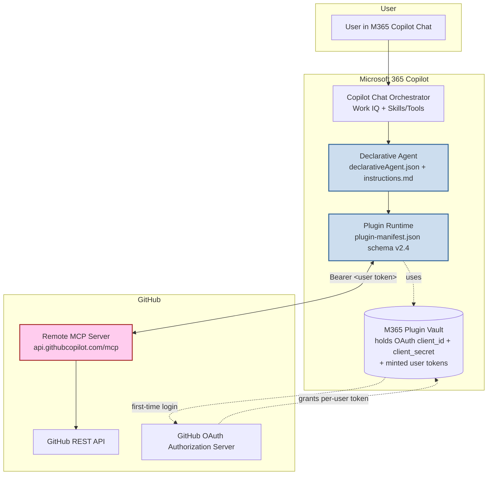
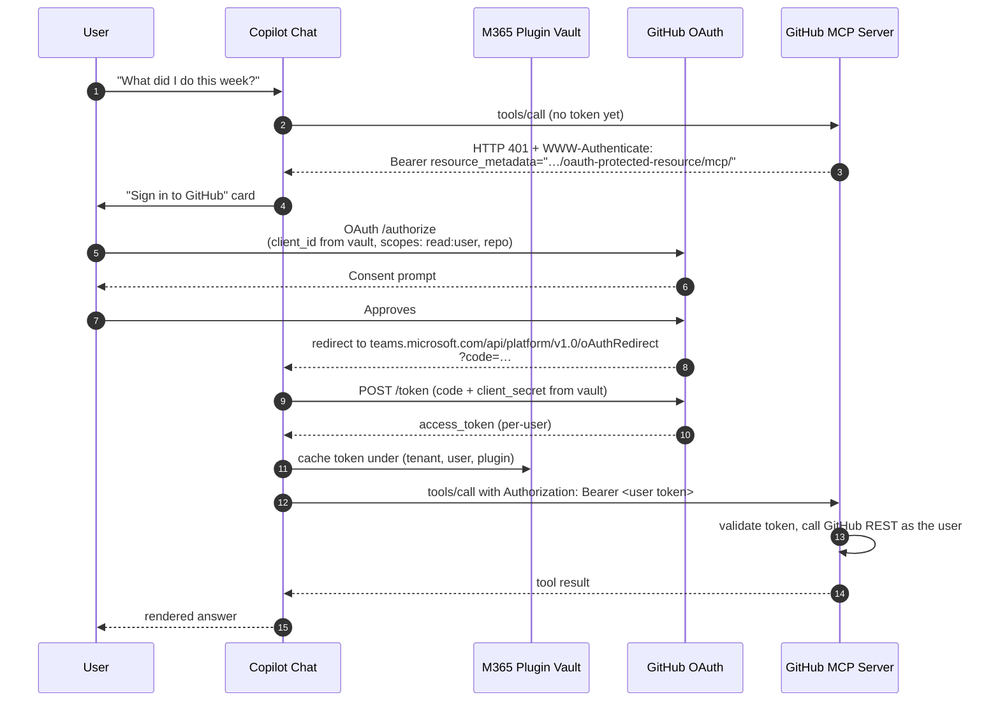
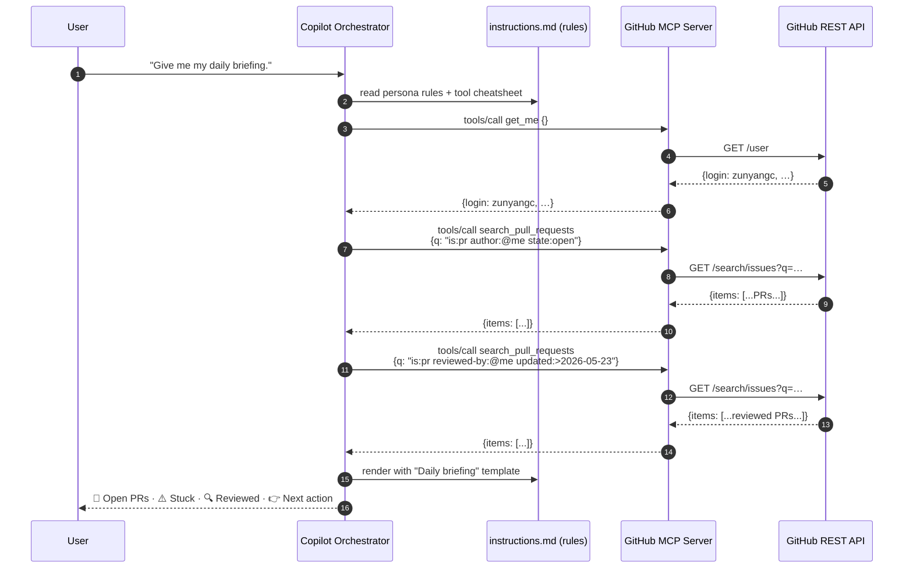

# Architecture

## Layered view

**What we own**: the two cyan boxes (the declarative agent + plugin
manifest). Everything else is Microsoft or GitHub infrastructure.

---

## OAuth handshake (per user, first call only)

Subsequent turns reuse the cached token until it expires; the runtime
silently refreshes (or re-prompts) as needed.

---

## End-to-end request flow (single turn after auth)

---

## File-by-file responsibility

| File                                  | Owns                                                                                  |
| ------------------------------------- | ------------------------------------------------------------------------------------- |
| `appPackage/manifest.json`            | Teams app shell — id, icons, developer info, points at the declarative agent          |
| `appPackage/declarativeAgent.json`    | Conversation starters, agent name/description, points at instructions + plugin       |
| `appPackage/plugin-manifest.json`     | Declares the 14 MCP function names, the `RemoteMCPServer` runtime, and OAuth config  |
| `appPackage/mcp-tools.json`           | The curated tool list (matches the MCP server's `tools/list` shape)                  |
| `appPackage/instructions.md`          | The brain — persona routing, tool selection, output formatting, safety               |

---

## Why MCP instead of OpenAPI

The predecessor (`enginsights-copilot` v0.10.3) used a custom OpenAPI
plugin pointing at a FastAPI service we hosted. That worked, but:

| Concern                  | OpenAPI plugin (v0.10.3)                 | MCP plugin (this repo)                          |
| ------------------------ | ---------------------------------------- | ----------------------------------------------- |
| Hosting                  | Our Azure App Service ($)                | GitHub's `api.githubcopilot.com/mcp/` (free)   |
| Auth                     | GitHub App + tenant-config JSON          | Per-user OAuth (canonical)                      |
| Adding a new endpoint    | Code + deploy + rebuild manifest         | Add the tool name to `mcp-tools.json`           |
| Standard compliance      | Custom REST contract                     | Model Context Protocol (Anthropic-led standard) |
| Hackathon scoring        | Bonus 3/4/5 not earned                   | Bonus 3, 4, 5 all earned                        |
